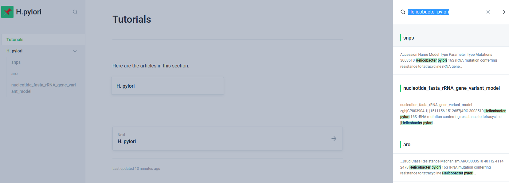

# Tutorials

| **抗生素** | 主要耐药机制 | 主要耐药基因 | **关键突变位点** | 备注 | 来源 |
| :--- | :--- | :--- | :--- | :--- | :--- |
| 克拉霉素 | antibiotic target alteration | 23S rRNA | A2146G | single resistance variant | PMID: 11120937 |
| 克拉霉素 | antibiotic target alteration | 23S rRNA | A2146C | single resistance variant | PMID: 11120937 |
| 克拉霉素 | antibiotic target alteration | 23S rRNA | A2146U | single resistance variant | PMID: 11120937 |
| 克拉霉素 | antibiotic target alteration | 23S rRNA | A2147C | single resistance variant | PMID: 11120937 |
| 克拉霉素 | antibiotic target alteration | 23S rRNA | A2147G | single resistance variant | PMID: 11120937 |
| 四环素 | antibiotic target alteration | 16S rRNA | A965G | single resistance variant | PMID: 12435699 |
| 四环素 | antibiotic target alteration | 16S rRNA | A965U,G966U,A967C | multiple resistance variants | PMID: 11914344 |
| 四环素 | antibiotic target alteration | 16S rRNA | A965G,A967C | multiple resistance variants | PMID: 12435699 |
| 四环素 | antibiotic target alteration | 16S rRNA | A965G,G966U | multiple resistance variants | PMID: 12435699 |
| 四环素 | antibiotic target alteration | 16S rRNA | A967C | single resistance variant | PMID: 12435699 |

_**References:**_

Alcock BP, Raphenya AR, Lau TTY, et al. CARD 2020: antibiotic resistome surveillance with the comprehensive antibiotic resistance database. Nucleic Acids Res. 2020;48\(D1\):D517-D525. doi:10.1093/nar/gkz935

Vester B, Douthwaite S. Macrolide resistance conferred by base substitutions in 23S rRNA. Antimicrob Agents Chemother. 2001;45\(1\):1-12. doi:10.1128/aac.45.1.1-12.2001

Dailidiene D, Bertoli MT, Miciuleviciene J, et al. Emergence of tetracycline resistance in Helicobacter pylori: multiple mutational changes in 16S ribosomal DNA and other genetic loci. Antimicrob Agents Chemother. 2002;46\(12\):3940-3946. doi:10.1128/aac.46.12.3940-3946.2002

Trieber CA, Taylor DE. Mutations in the 16S rRNA genes of Helicobacter pylori mediate resistance to tetracycline. J Bacteriol. 2002;184\(8\):2131-2140. doi:10.1128/jb.184.8.2131-2140.2002

